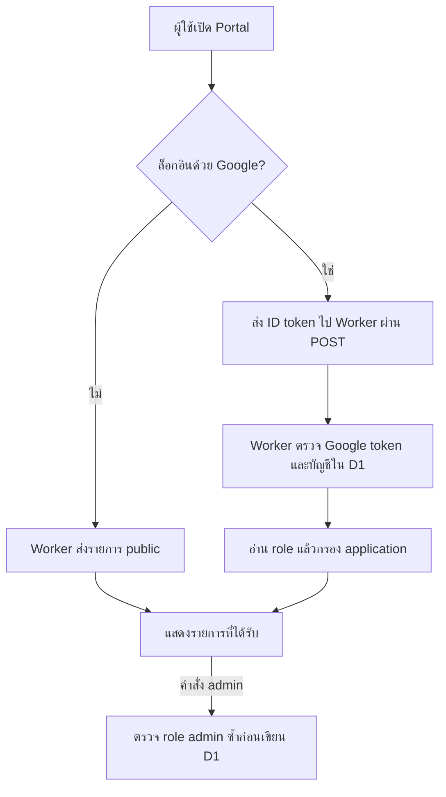

<div align="center">

# ⊞ Koo Mean Portal

### ทางเข้าแอปและเว็บไซต์ พร้อมรายการตามสิทธิ์บัญชี


[ภาพรวม](#overview) · [ฟีเจอร์](#features) · [ผู้ใช้และสิทธิ์](#roles) · [ติดตั้ง](#setup)

</div>

> Portal รวมทางเข้าแอปไว้ที่เดียว ผู้ใช้เห็นเฉพาะรายการที่ backend อนุญาต ส่วนการจัดการรายการทำได้เมื่อบัญชีมี role ผู้ดูแล

<a id="overview"></a>
## 🌟 ภาพรวม

หน้าเว็บ [`https://koomean.com/`](koomeanportal.html) เป็น HTML/CSS/JavaScript แบบ standalone ไม่ต้อง build สามารถ host บน HTTPS static hosting ใดก็ได้ที่รองรับหน้า HTML คำว่า Portal เป็นชื่อผลิตภัณฑ์ ไม่ได้บังคับให้ต้องมี subdomain `portal.koomean.com`



Backend config อยู่ที่ [`../CloudFlare/wrangler.portal.jsonc`](../CloudFlare/wrangler.portal.jsonc) โดยกำหนด `koomean-d1-worker.js` เป็น Worker entry point

<a id="features"></a>
## ✨ ฟีเจอร์

| ฟีเจอร์ | การทำงาน |
|---|---|
| **🧭 รวมแอปและลิงก์** | แสดงชื่อ คำอธิบาย ไอคอน สี และสถานะปักหมุดของรายการใน Portal |
| **🔐 Google Sign-In** | ใช้ Google Identity Services ส่ง ID token ไปให้ Worker ตรวจสอบ |
| **📝 ลงทะเบียนผู้ใช้ใหม่** | ส่งคำขอสมัครเข้าระบบ; การให้ role เพิ่มเติมขึ้นกับการจัดการของ admin |
| **🛡️ Role-based listing** | กรอง application ตาม Group/role ก่อนส่งข้อมูลลง browser |
| **👤 หน้าบัญชี** | แสดงข้อมูลผู้ใช้และรองรับการแก้ชื่อที่ backend เปิดให้ |
| **⚙️ Admin application manager** | เพิ่ม แก้ไข ลบ และจัดลำดับรายการแอปใน D1 |
| **👥 Admin user tools** | ดู/จัดการบัญชีและ role ผ่าน backend actions ที่จำกัดสิทธิ์ |
| **🎨 Preferences** | จำค่าการแสดงผลบางอย่างใน browser ของผู้ใช้ |

<a id="roles"></a>
## 👥 ผู้ใช้และสิทธิ์

| สถานะ | สิ่งที่ทำได้ |
|---|---|
| ไม่ได้ล็อกอิน | ดูรายการสาธารณะที่ Worker ส่งให้ |
| ล็อกอินแต่ยังไม่ลงทะเบียน | ส่งคำขอลงทะเบียนและใช้รายการ public ตาม backend |
| ผู้ใช้ที่มี role | ดูรายการ public และรายการที่ Group ตรงกับ role |
| `admin` | จัดการ application และผู้ใช้ตาม action ที่ Worker อนุญาต |

สิทธิ์หลักเก็บใน D1 (`users` และ `application`) และตรวจใน Worker ทุกครั้ง การแก้ HTML หรือส่งค่า role ปลอมจาก browser ไม่ควรทำให้ได้รับสิทธิ์เพิ่ม

## 🗄️ การจัดเก็บข้อมูล

| D1 table | ใช้เก็บ |
|---|---|
| `application` | รายการแอปและลิงก์ที่ Portal แสดง รวม URL, Group, สี และลำดับ |
| `users` | email, ชื่อ, role และข้อมูลผู้ใช้ |
| `profile` | ข้อมูล profile ที่แสดงร่วมในระบบ |

Portal ไม่เก็บบทความหรือไฟล์ในตัวเอง; การจัดเก็บข้อมูลของ Blog และ Site อธิบายไว้ใน README ประจำเว็บเหล่านั้น

<a id="setup"></a>
## 🚀 เริ่มต้นใช้งาน

### ☁️ เตรียม Worker และ D1

ตรวจว่า `../CloudFlare/wrangler.portal.jsonc` มี D1 binding `DB` ชี้ฐานข้อมูลที่ถูกต้อง และ `ALLOWED_ORIGINS` มีโดเมนที่จะ host Portal จากโฟลเดอร์ `CloudFlare` deploy ด้วย:

```bash
npx wrangler deploy --config wrangler.portal.jsonc
```

เตรียม schema และข้อมูล D1 ก่อนใช้งาน คู่มือย้ายข้อมูลอยู่ที่ [`../CloudFlare/MIGRATE-SHEETS-TO-D1.md`](../CloudFlare/MIGRATE-SHEETS-TO-D1.md); ใช้ `portal-d1-migration.sql` เมื่อ migration นั้นตรงกับสถานะฐานข้อมูล

### 🌐 Host หน้าเว็บและ OAuth

1. เผยแพร่ `koomeanportal.html` บน HTTPS static hosting
2. ตรวจ `API_URL` ในไฟล์ให้ตรง Worker URL
3. เพิ่ม origin ของ Portal ใน Google OAuth Client → **Authorized JavaScript origins**
4. เพิ่ม origin เดียวกันใน Worker `ALLOWED_ORIGINS`
5. ตรวจว่ามีบัญชี admin ที่ใช้งานได้ใน D1 ก่อนทดลองเมนูจัดการ

ระบุเฉพาะ origin เช่น `https://example.com` ไม่ใส่ path `/koomeanportal.html`

## 🧑‍💻 แนวทางพัฒนา

- UI และ client logic อยู่ใน `koomeanportal.html`
- API, การกรอง application และการตรวจ admin อยู่ใน [`../CloudFlare/koomean-d1-worker.js`](../CloudFlare/koomean-d1-worker.js)
- เปลี่ยนโดเมนต้องปรับทั้ง API URL, Google OAuth origins และ Worker CORS
- ทดสอบอย่างน้อยสี่กรณี: anonymous, ผู้ใช้ใหม่, ผู้ใช้ทั่วไป และ admin
- อย่า commit client secret, access token ถาวร หรือ service-account key; public OAuth Client ID ไม่ใช่ secret

## ℹ️ ขอบเขต

README นี้บรรยาย source/config ใน repository ไม่ได้ยืนยันว่า static host หรือ Cloudflare production ใช้ revision ล่าสุดแล้ว
